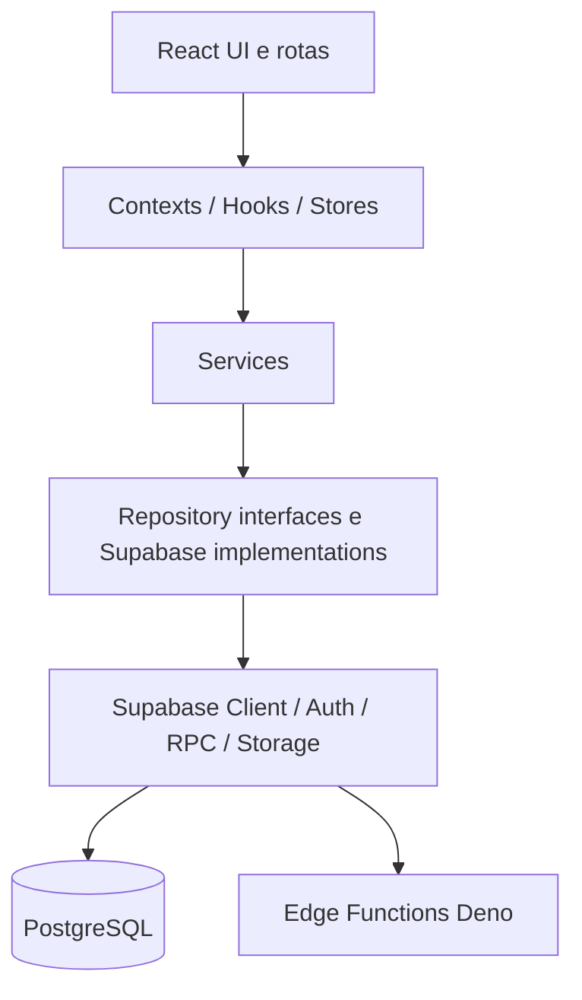

# StudySystem — Execution Contract

## 1. Autoridade

Este documento é a autoridade canônica sobre arquitetura, segurança, dados e guardrails técnicos. Ele não substitui `docs/FSD.md`, `docs/DESIGN.md`, `docs/POC_ACCEPTANCE.md` ou `docs/STATUS.md` em seus domínios.

## 2. Baseline técnico preservado

- React 19, TypeScript e Vite permanecem o frontend.
- React Router define as rotas.
- Contexts, hooks, TanStack Query e Zustand sustentam estado de sessão, dados remotos e UI.
- Services orquestram casos de uso.
- Interfaces e implementações de repositories isolam persistência.
- Supabase é backend/persistência: Auth, PostgreSQL, Storage, RPCs e Edge Functions Deno.
- Não criar um backend Node paralelo sem decisão arquitetural e Gate específico.

## 3. Fluxo de camadas

Composição atual: `services/Dependencies.ts`. Cliente: `services/supabaseClient.ts`.

## 4. Contratos de persistência

| Domínio | Repository/Service | Tabelas ou RPCs observados |
|---|---|---|
| Cursos e aulas | `SupabaseCourseRepository`, `CourseService` | `courses`, `modules`, `lessons`, `lesson_resources`, `course_enrollments` |
| Progresso | `SupabaseUserProgressRepository` | `lesson_progress`, `lesson_progress_requirements`, `update_lesson_progress_secure` |
| Quiz | `SupabaseQuizRepository` | `quizzes`, `quiz_questions`, `quiz_options`, `quiz_attempts` |
| Quiz seguro do aluno | `SupabaseQuizRepository` | `get_lesson_quiz_for_student` |
| Submissão | `SupabaseQuizRepository` | `submit_quiz_attempt` |
| Questões dinâmicas | `SupabaseQuizRepository`, `SupabaseQuestionBankRepository` | `question_bank`, RPCs de pool e prática |
| Perfil/auth | `SupabaseAuthRepository`, `SupabaseUserProfileRepository` | Supabase Auth, `profiles`, `user_achievements` |

Não contornar repositories para criar acesso paralelo sem justificativa e autorização.

## 5. Autenticação e autorização

- O cliente usa sessão Supabase e identidade autenticada.
- Regras de produto não podem confiar somente na UI ou em rota client-side.
- RLS deve permanecer habilitada e não pode ser enfraquecida.
- Progresso e conteúdo devem respeitar `auth.uid()`, enrollment, atribuição, papel e regras server-side existentes.
- RPCs `SECURITY DEFINER` devem fixar `search_path`, validar autenticação/autorização e ter grants mínimos.
- Service role e Management API tokens só podem existir em runtime server-side autorizado; nunca no cliente.
- Novos mecanismos de autorização não podem conceder privilégio com base em identidade pessoal hard-coded.
- Privilégios devem derivar de contratos de autorização server-side explicitamente definidos.
- O desvio histórico de identidade privilegiada hard-coded é conhecido e deve ser tratado em Gate de segurança; migrations históricas não devem ser reescritas neste Gate.

## 6. Secrets e IA

- Nunca versionar secrets.
- A allowlist de envs públicas do frontend é limitada às chaves públicas observadas em `scripts/static_security_check.mjs`: `VITE_SUPABASE_URL`, `VITE_SUPABASE_ANON_KEY` e `VITE_DROPBOX_APP_KEY`.
- `VITE_GEMINI_API_KEY` e `VITE_API_KEY` são bloqueadas.
- `AIService` deve chamar Edge Function autenticada para IA; sincronização RAG no browser permanece bloqueada.
- A chave Google AI do aluno, quando usada, é local ao dispositivo e não deve ser registrada em logs ou incluída no bundle institucional.
- RAG só é considerado seguro quando a migration de hardening e as pré-condições do ambiente estiverem aplicadas; sua validação operacional deve ser consultada em `docs/STATUS.md`.

## 7. Migrations e banco

- Migrations históricas são append-only por padrão e não devem ser reescritas.
- Correções de schema, RPC, RLS ou grants exigem migration nova e Gate específico.
- Não alterar banco Supabase remoto neste contrato.
- A migration `20260621000100_security_lgpd_critical_remediation.sql` possui comportamento defensivo e pode não aplicar hardening quando pré-requisitos RAG não existem; isso deve permanecer explícito.
- Não fabricar dados de demonstração nem executar escrita remota sem autorização.
- Não introduzir novos fallbacks de persistência que alterem a semântica de uma RPC segura sem Gate específico.
- O fallback direto atual de progresso deve ser validado antes de ser considerado semanticamente equivalente à RPC segura.

## 8. CI, dependências e publicação

- Alterações em `.github/`, `package.json`, `package-lock.json`, dependências ou scripts de segurança exigem Gate próprio.
- Dependências com risco relevante exigem triagem antes de publicação.
- Os resultados atuais de build, testes e segurança estão em `docs/STATUS.md`.
- Incidentes de segurança e dependências estão registrados em `docs/ERROS.md`.
- Não declarar deploy público, URL ou repositório público sem evidência.
- Push, merge, publicação e deploy exigem autorização explícita.

## 9. Web/mobile e validação

- Preservar responsividade web e estados de loading, error, blocked e result.
- Classes Tailwind ou componentes móveis comprovam implementação, não validação física.
- Cada ciclo deve executar validação proporcional ao risco, registrar evidências e congelar o escopo antes do próximo Gate.

## 10. Regra STOP

Parar se a mudança exigir enfraquecer RLS, expor secret, reescrever migration histórica, modificar código para satisfazer documentação, ignorar conflito de arquitetura/segurança ou alterar arquivo fora do escopo. Nenhum agente pode redefinir silenciosamente contratos canônicos.
