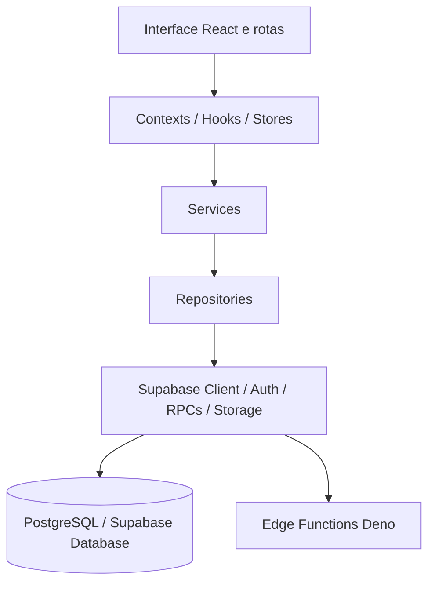

# Arquitetura e Tecnologias — StudySystem

## 1. Visão arquitetural da PoC

A PoC utiliza a arquitetura real do StudySystem. O frontend é uma aplicação React com TypeScript e Vite; a lógica de aplicação é organizada por contexts, hooks, services e repositories; e a persistência utiliza Supabase/PostgreSQL.

A segunda entrega não introduziu um backend paralelo nem uma arquitetura especial apenas para a demonstração. A PoC percorre as mesmas camadas utilizadas pelo produto.



As dependências concretas são compostas em `services/Dependencies.ts` e o cliente Supabase é criado em `services/supabaseClient.ts`.

## 2. Frontend

- **React 19:** composição da interface.
- **TypeScript:** tipagem do domínio, serviços e componentes.
- **Vite:** ambiente de desenvolvimento e build de produção.
- **React Router:** rotas de dashboard, cursos, aulas e áreas protegidas.
- **Tailwind CSS:** estilos e composição responsiva.
- **TanStack Query:** consulta e cache de dados remotos.
- **Zustand e React Context:** estados globais, sessão e estado complementar.

O projeto utiliza carregamento sob demanda para diversas páginas e componentes de maior porte.

## 3. Backend e persistência

Não existe um backend Node monolítico separado.

O backend da aplicação é composto por:

- Supabase Auth para autenticação;
- PostgreSQL/Supabase Database para usuários, cursos, aulas, quizzes, tentativas e progresso;
- Supabase Storage quando aplicável aos materiais;
- RPCs PostgreSQL para operações controladas da jornada;
- Edge Functions Deno para integrações server-side, incluindo recursos opcionais como IA.

## 4. Repository Pattern

Os repositories isolam chamadas ao Supabase e fazem o mapeamento entre registros persistidos e entidades utilizadas pela aplicação.

| Responsabilidade | Repository/Service | Dados ou RPCs relacionados |
|---|---|---|
| Cursos, módulos e aulas | `SupabaseCourseRepository` / `CourseService` | `courses`, `modules`, `lessons`, `course_enrollments`, `lesson_progress` |
| Conteúdo detalhado da aula | `SupabaseCourseRepository` | `lessons`, `lesson_resources` |
| Questionários e tentativas | `SupabaseQuizRepository` | `quizzes`, `quiz_questions`, `quiz_options`, `quiz_attempts` |
| Questionário do aluno | `SupabaseQuizRepository` | `get_lesson_quiz_for_student` |
| Submissão avaliativa | `SupabaseQuizRepository` | `submit_quiz_attempt` |
| Progresso da aula | `SupabaseUserProgressRepository` | `lesson_progress`, `update_lesson_progress_secure` |
| Orquestração de progresso | `CourseService` | atualização do progresso e regras de conclusão |

## 5. Caminho de dados da PoC

### Curso

O fluxo de cursos começa em `StudentDashboard`, passa pelo contexto/hooks de cursos e chega ao `SupabaseCourseRepository`, que consulta cursos, módulos e aulas acessíveis ao usuário.

### Aula

`CourseOverview` navega para a rota da aula. `LessonLoader` resolve a aula ativa e entrega o conteúdo a `LessonViewer`.

### Questionário

`LessonViewer` utiliza `useLessonQuiz`. Na jornada da PoC, `get_lesson_quiz_for_student` fornece ao frontend do estudante o conteúdo necessário ao questionário **sem retornar o marcador de resposta correta no contrato utilizado pela UI**. Essa formulação descreve o caminho comprovado da PoC e não pretende afirmar impossibilidade absoluta de acesso por qualquer superfície do sistema.

A submissão avaliativa utiliza `submit_quiz_attempt`.

### Tentativa

O resultado é representado por `QuizResultsModal`. A tentativa é persistida pelo fluxo server-side da RPC `submit_quiz_attempt`, com registro em `quiz_attempts`. A validação da PoC confirmou a tentativa por read-after-write autenticado.

### Progresso

`CourseContext` chama `CourseService.updateUserProgress`. O `SupabaseUserProgressRepository` utiliza `update_lesson_progress_secure` no caminho principal e consulta `lesson_progress` para recuperar o estado posteriormente.

O repositório mantém documentado um fallback legado de progresso cuja equivalência semântica com a RPC principal não foi formalmente comprovada. A Fase A não altera nem reclassifica esse comportamento.

## 6. Migrations e alinhamento operacional

Após a reconciliação controlada do histórico de migrations, o diretório ativo e o ledger remoto ficaram alinhados:

```text
ACTIVE_MIGRATIONS=39
REMOTE_MIGRATIONS=39
ACTIVE_LOCAL_ONLY=0
REMOTE_ONLY=0
ACTIVE_DUPLICATES=0
MIGRATION_ALIGNMENT=39/39
LEVEL_1_OPERATIONAL_ALIGNMENT_COMPLETE=SIM
```

Durante essa reconciliação, **27 migrations históricas** foram preservadas em `archive/supabase-migrations/`. O conteúdo SQL histórico foi mantido; a mudança organizou a proveniência para separar arquivos históricos do conjunto ativo, sem aplicar essas 27 migrations novamente no banco remoto.

A validação operacional final do ciclo de reconciliação foi concluída antes desta sincronização acadêmica. A Fase A não executa `db push`, `migration repair`, DDL, DML ou qualquer escrita remota de banco.

Exemplos de migrations relevantes para a jornada:

- `supabase/migrations/20260311084400_comprehensive_rls_hardening.sql`: políticas de acesso e RLS, incluindo `lesson_progress`.
- `supabase/migrations/20260311203000_fix_block_id_type_to_text.sql`: versão da RPC `update_lesson_progress_secure`.
- `archive/supabase-migrations/20260703020000_harden_submit_quiz_attempt.sql`: hardening da RPC `submit_quiz_attempt`.
- `archive/supabase-migrations/20260703030000_add_student_lesson_quiz_rpc.sql`: RPC `get_lesson_quiz_for_student`.
- migrations posteriores de julho e agosto de 2026 refinam autorização e segurança em domínios relacionados.

## 7. Justificativa das tecnologias

- **React e TypeScript:** adequados para telas interativas e contratos explícitos entre domínio, serviços e componentes.
- **Vite:** fornece desenvolvimento local e build de produção para a aplicação web.
- **Tailwind CSS:** organiza estilos responsivos usados na jornada demonstrada.
- **Supabase/PostgreSQL:** reúne autenticação, persistência relacional, RPCs e políticas de autorização.
- **Repository Pattern:** reduz o acoplamento entre interface e infraestrutura de dados e torna a camada de persistência identificável na PoC.

## 8. Evidência técnica atual

```text
FUNCTIONAL_POC=PASS
UNIT_TESTS=137/137 PASS
UNIT_TEST_SUITES=27/27 PASS
TYPECHECK=PASS
BUILD=PASS
SECURITY_SCAN=PASS
MIGRATION_ALIGNMENT=39/39
REMOTE_DATABASE_WRITE_EXECUTED_IN_PHASE_A=NAO
```

A PoC funcional foi validada com aluno autenticado em desktop e viewport mobile aproximado de 390 x 844. A integração frontend/backend/banco, a persistência da tentativa, o progresso e a recuperação posterior foram demonstrados.

Essas evidências não equivalem a uma declaração de que toda a superfície do banco, todas as funcionalidades secundárias ou todos os dispositivos possíveis estejam integralmente homologados. A publicação pública do repositório pertence a uma trilha de segurança separada.
